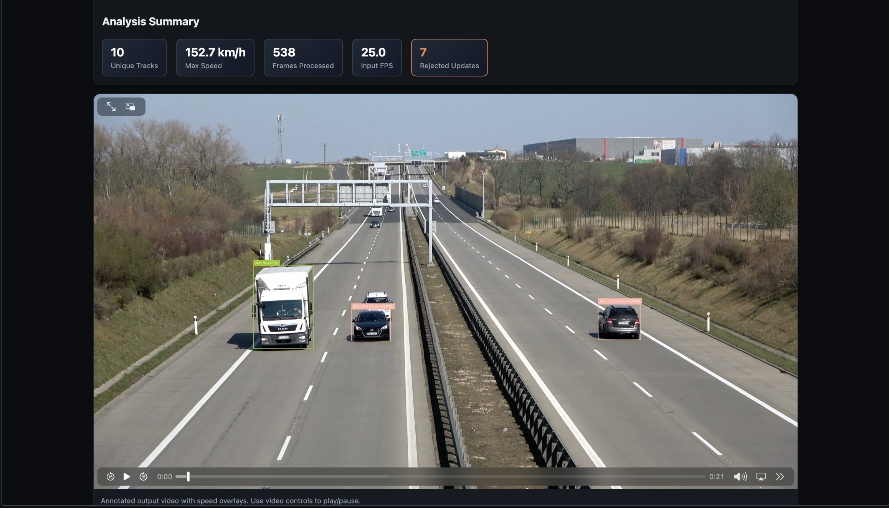
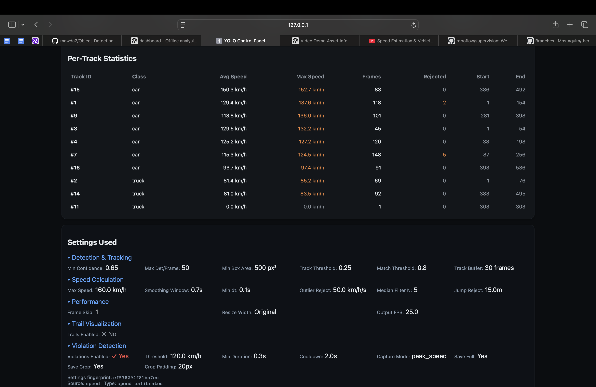

<div align="center">

# 🚦 TrafficIQ

### AI-Powered Traffic Study Platform

**Turn any intersection video into a professional traffic engineering study — speed measurements, turning movement counts, peak hour analysis, and Synchro-ready reports.**

[](https://python.org)
[](https://flask.palletsprojects.com)
[](https://github.com/ultralytics/ultralytics)
[](LICENSE)


</div>

---

## What Is TrafficIQ?

TrafficIQ is an open-source, web-based computer vision platform that automates **traffic data collection** from video. It replaces manual intersection counting with an end-to-end pipeline:

1. **Upload** a traffic video
2. **Calibrate** with 4 reference points for real-world accuracy
3. **Draw counting lines** across intersection approaches
4. **Run analysis** — YOLO v11 detects vehicles, ByteTrack maintains persistent IDs
5. **Get results** — calibrated speeds, turning movement counts, peak hour factors, violation snapshots, and publication-ready reports

The output is what a traffic engineer would normally spend hours collecting by hand or thousands of dollars on commercial software to produce.

---

## Table of Contents

- [Key Features](#key-features)
- [How It Works](#how-it-works)
- [Quick Start](#quick-start)
- [Usage Guide](#usage-guide)
- [Project Structure](#project-structure)
- [Tech Stack](#tech-stack)
- [Configuration](#configuration)
- [API Reference](#api-reference)
- [Testing](#testing)
- [License](#license)
- [Contributing](#contributing)

---

## Key Features

### 🎯 Calibrated Speed Measurement

- **Homography-based calibration** — 4 ground-plane reference points for perspective-correct speed in km/h
- **Multi-stage smoothing** — outlier rejection → median filter (5-sample) → EMA (α=0.3) → jump detection
- **Speed violation detection** — configurable thresholds with automatic full-frame + cropped evidence snapshots
- **Motion trail visualization** — track vehicle paths with configurable duration, thickness, and fade

### 📊 Turning Movement Counts (TMC)

- **Interactive counting lines** — draw up to 4 virtual lines on the video frame, each with a compass direction (NB/SB/EB/WB)
- **Line crossing detection** — cross-product sign-change algorithm with displacement guards against double-counts
- **Turn classification** — entry/exit pairing automatically classifies movements as Left, Through, Right, or U-Turn
- **15-minute interval binning** — clock-aligned bins mapped from video time to real-world study time

### 📈 Traffic Engineering Metrics

- **AM/PM peak hour identification** — sliding 4-bin window analysis within configurable search periods
- **Peak Hour Factor (PHF)** — standard PHF = V / (4 × V_max,15)
- **Heavy vehicle percentage** — automatic classification of trucks, buses, motorcycles
- **Per-approach, per-movement, per-class breakdowns** — full granularity

### 📑 Professional Report Export

| Format           | Description                                                                                                                     |
| ---------------- | ------------------------------------------------------------------------------------------------------------------------------- |
| **TMC PDF**      | Multi-page report (cover page + landscape data table + speed summary) via ReportLab — ready for Traffic Impact Study appendices |
| **UTDF CSV**     | Synchro-compatible `Volume.csv` for direct import into Synchro / SimTraffic                                                     |
| **Speed CSV**    | Per-vehicle speed log with 85th-percentile statistical summary                                                                  |
| **Tracks CSV**   | Per-frame detection data with track IDs, positions, and speeds                                                                  |
| **Summary JSON** | Complete analysis metadata, per-track statistics, settings fingerprint                                                          |

### 🎬 Video Analysis Modes

- **Traffic Study** (`/speed`) — full calibrated pipeline with TMC, speed, and violations
- **Quick Analysis** (`/offline`) — simple upload → YOLO + ByteTrack with pixel-displacement speed
- **Cloud Inference** (`/roboflow`) — Roboflow API integration, no local GPU required
- **Live Streaming** (`/grid`) — real-time ROS 2 multi-camera streams (Linux only)

### 🗄️ Analysis Library

- Content-addressed deduplication (SHA-256) — same video + same settings = cached results
- Searchable, sortable grid of all past analyses with video playback and export
- Settings fingerprinting — only re-runs when parameters actually change

---

## How It Works

### Detection & Tracking Pipeline

```
Video Frame
    │
    ▼
┌─────────────────────────┐
│  YOLO v11 Inference      │  80+ COCO classes, configurable confidence
│  (Ultralytics)           │  threshold, class filtering, max detections
└───────────┬─────────────┘
            ▼
┌─────────────────────────┐
│  ByteTrack Tracking      │  Persistent IDs across frames
│  (Supervision)           │  Two-stage matching (high + low confidence)
└───────────┬─────────────┘
            ▼
┌─────────────────────────┐
│  Homography Projection   │  Pixel coords → world coords via 3×3 matrix
│  (4-point calibration)   │  Real-world distance and speed
└───────────┬─────────────┘
            ▼
    ┌───────┼───────┐
    ▼       ▼       ▼
 Speed   Counting  Violation
 Calc    Lines     Tracker
    │       │       │
    ▼       ▼       ▼
 Smoothed  Crossing  Snapshot
 km/h     Events    Evidence
            │
            ▼
    Turn Movement
    Classifier (L/T/R/U)
            │
            ▼
    15-min Interval
    Aggregator
            │
            ▼
    ┌───────────────┐
    │  Output:       │
    │  • Video .mp4  │
    │  • TMC PDF     │
    │  • UTDF CSV    │
    │  • Speed CSV   │
    │  • Tracks CSV  │
    │  • JSON        │
    │  • Violations  │
    └───────────────┘
```

### Speed Smoothing Pipeline

```
Raw Speed → Outlier Rejection → Median Filter → EMA Smoothing → Final Speed
             (acceleration      (5-sample        (α = 0.3)
              ≤ 50 km/h/s)      window)
```

### TMC Pipeline

```
Counting Lines (user-defined, up to 4)
    │
    ▼
Line Crossing Detector ── per-frame centroid tracking
    │                     cross-product sign change
    ▼
Crossing Events ── track ID, direction, timestamp, speed, vehicle class
    │
    ▼
Turn Movement Classifier ── entry/exit pairing → L/T/R/U
    │                        timeout-based flush for incomplete tracks
    ▼
Interval Aggregator ── 15-min clock-aligned bins
    │                   video-time → wall-clock mapping
    ▼
Traffic Study Result ── peak hours, PHF, heavy %, per-approach totals
    │
    ▼
Report Generator ── PDF, UTDF CSV, Speed CSV
```

---

## Quick Start

### Prerequisites

- **Python 3.10+**
- **macOS** or **Linux** (Windows via WSL2)
- **ffmpeg** (for browser-compatible H.264 video encoding)
- ~2 GB disk space for dependencies

```bash
# macOS
brew install ffmpeg

# Ubuntu / Debian
sudo apt install ffmpeg
```

### 1. Clone & Setup

```bash
git clone https://github.com/mowda2/MoeWS.git
cd MoeWS

# Automated setup (creates venv, installs deps, downloads YOLO model)
./scripts/setup.sh
```

<details>
<summary>Manual setup</summary>

```bash
python3 -m venv venv
source venv/bin/activate
pip install -r requirements.txt

# Download YOLO v11 nano model (~6 MB)
wget https://github.com/ultralytics/assets/releases/download/v8.3.0/yolo11n.pt
```

</details>

### 2. Start the Dashboard

```bash
./scripts/run_dashboard.sh
```

<details>
<summary>Manual start</summary>

```bash
source venv/bin/activate
export PYTHONPATH="$PWD/src"
python -m moe_yolo_pipeline.moe_yolo_pipeline.web_video_bridge
```

</details>

### 3. Open in Browser

| Page               | URL                           | Description                              |
| ------------------ | ----------------------------- | ---------------------------------------- |
| **Dashboard**      | http://localhost:5000         | Home — feature cards and navigation      |
| **Traffic Study**  | http://localhost:5000/speed   | Full calibrated speed + TMC workflow     |
| **Quick Analysis** | http://localhost:5000/offline | Simple upload → detection + tracking     |
| **Library**        | http://localhost:5000/library | All past analyses with playback & export |

---

## Usage Guide

### Traffic Study (Calibrated Speed + TMC)

This is the primary workflow for producing a complete traffic engineering study from video.

**Step 1 — Upload**

1. Navigate to **http://localhost:5000/speed**
2. Upload a traffic video (MP4, MOV)
3. Optionally adjust the ~40 advanced settings (detection, tracking, speed, trails, violations, TMC)

**Step 2 — Calibrate**

1. **Calibration Points** — Click 4 ground-plane reference points on the video frame and enter their real-world coordinates in meters. The system computes a 3×3 homography matrix for perspective-correct measurements.
2. **Counting Lines** — Switch to the Counting Lines tab and draw up to 4 virtual lines across intersection approaches. Each line gets a compass direction (NB, SB, EB, WB) and a distinct color. Perpendicular arrows indicate the crossing direction.
3. Set the **study start time** (e.g., `07:00`) to map video timestamps to real-world clock time.

**Step 3 — Run Analysis**

Click "Run Analysis" — progress streams in real-time via SSE. The engine processes every frame (or every Nth frame with `frame_skip`) through YOLO → ByteTrack → homography → speed → counting → TMC → violations.

**Step 4 — Results**

The results page shows:

- **Summary cards** — total volume, AM/PM peak hours, heavy vehicle %
- **Annotated video** — bounding boxes, track IDs, speed labels, motion trails
- **Grouped TMC table** — approach × movement with hourly subtotals and peak-hour highlighting
- **Intersection diagram** — SVG approach volume visualization
- **Speed histogram** — distribution across all tracked vehicles
- **Violation gallery** — full-frame + cropped snapshots with metadata
- **Export buttons** — download TMC PDF, UTDF CSV, Speed CSV, and raw data





### Quick Video Analysis

For simple detection and tracking without calibration:

1. Navigate to **http://localhost:5000/offline**
2. Upload video, set confidence threshold and device (`cpu` or `cuda:0`)
3. View results: annotated video, CSV export, JSON summary
4. Results are automatically saved to the **Library**

### Roboflow Cloud Inference

For GPU-free analysis using Roboflow's API:

```bash
export ROBOFLOW_API_KEY="your_key"
export ROBOFLOW_MODEL="coco/1"
```

Navigate to **http://localhost:5000/roboflow**, upload video, and view detections.

---

## Project Structure

```
MoeWS/
├── src/moe_yolo_pipeline/
│   └── moe_yolo_pipeline/              # Main Python package
│       ├── web_video_bridge.py          # Flask app entry point & blueprint registration
│       │
│       │── speed_analyzer.py            # Core engine: YOLO + tracking + homography
│       │                                #   + speed + counting + TMC + violations
│       ├── speed_routes.py              # /speed blueprint: upload → calibrate → run → results
│       │
│       ├── offline_analyzer.py          # Simple pipeline: YOLO + tracking + pixel speed
│       ├── offline_routes.py            # /offline blueprint with content-addressed caching
│       │
│       ├── counting.py                  # Virtual counting lines & crossing detection
│       ├── turn_movements.py            # L/T/R/U classification at 4-leg intersections
│       ├── interval_binning.py          # 15-min aggregation, peak hours, PHF
│       ├── report_generator.py          # PDF, UTDF CSV, Speed CSV export
│       │
│       ├── library_db.py               # SQLite persistence (WAL, thread-safe)
│       ├── camera_publisher.py          # ROS 2 camera node (optional)
│       ├── yolo_visualization_node.py   # ROS 2 overlay node (optional)
│       │
│       ├── templates/                   # Jinja2 HTML templates
│       │   ├── index.html               #   Dashboard home
│       │   ├── offline.html             #   Quick analysis page
│       │   ├── library.html             #   Analysis library
│       │   ├── grid.html                #   Multi-camera grid (ROS 2)
│       │   └── speed/                   #   Traffic study module
│       │       ├── index.html           #     Upload + settings
│       │       ├── calibrate.html       #     Calibration + counting lines
│       │       └── results.html         #     Results + TMC + exports
│       │
│       ├── static/                      # CSS assets
│       └── data/                        # SQLite DB, media uploads
│
├── runs/speed/                          # Speed analysis job outputs
├── data/                                # Videos & outputs
├── scripts/
│   ├── setup.sh                         # Automated environment setup
│   └── run_dashboard.sh                 # Start script (auto-detects ROS 2)
├── tests/                               # Smoke tests
├── requirements.txt                     # 45 Python dependencies
├── yolo11n.pt                           # YOLO v11 nano weights (~6 MB)
└── README.md
```

---

## Tech Stack

### Core

| Component      | Technology                                     | Purpose                                  |
| -------------- | ---------------------------------------------- | ---------------------------------------- |
| **Web Server** | [Flask 3.1](https://flask.palletsprojects.com) | REST API, Jinja2 templates, SSE progress |
| **Frontend**   | Vanilla JS + HTML5 SVG/Canvas                  | No framework — fast, portable            |
| **Database**   | SQLite (WAL mode)                              | Thread-safe analysis library             |

### Computer Vision & AI

| Component     | Technology                                                         | Purpose                                  |
| ------------- | ------------------------------------------------------------------ | ---------------------------------------- |
| **Detection** | [Ultralytics YOLO v11](https://github.com/ultralytics/ultralytics) | Real-time object detection (80+ classes) |
| **Tracking**  | [Supervision ByteTrack](https://github.com/roboflow/supervision)   | Persistent ID tracking across frames     |
| **Vision**    | OpenCV 4.12                                                        | Video I/O, homography, frame processing  |
| **Inference** | PyTorch 2.8                                                        | Neural network backend (CPU or CUDA)     |
| **Reports**   | ReportLab 4.0+                                                     | Publication-quality PDF generation       |
| **Data**      | NumPy, SciPy, Polars                                               | Numerical processing and data analysis   |

### Speed & TMC

| Component           | Method                               | Purpose                             |
| ------------------- | ------------------------------------ | ----------------------------------- |
| **Calibration**     | 3×3 homography matrix                | Pixel → world coordinate transform  |
| **Speed smoothing** | Outlier reject → median → EMA        | Robust noise reduction              |
| **Counting**        | Cross-product sign-change            | Line crossing detection             |
| **TMC**             | Entry/exit pairing + movement matrix | Turn classification                 |
| **Binning**         | Clock-aligned 15-min intervals       | Standard traffic engineering format |

### Optional

| Component    | Technology    | Purpose                             |
| ------------ | ------------- | ----------------------------------- |
| **ROS 2**    | Humble / Iron | Live multi-camera streaming (Linux) |
| **Roboflow** | Cloud API     | GPU-free inference                  |

---

## Configuration

### Environment Variables

<details>
<summary><strong>Detection & Tracking</strong></summary>

| Variable                 | Default | Description                             |
| ------------------------ | ------- | --------------------------------------- |
| `MOE_TRACK_MIN_CONF`     | `0.0`   | Extra confidence filter                 |
| `MOE_TRACK_MIN_BOX_AREA` | `0`     | Minimum bounding box area (px²)         |
| `MOE_TRACK_CLASSES`      | `""`    | Class filter (comma-separated COCO IDs) |
| `MOE_TRACK_BUFFER`       | `30`    | ByteTrack lost track buffer (frames)    |
| `MOE_TRACK_THRESH`       | `0.25`  | Track activation threshold              |
| `MOE_SHOW_TRAILS`        | `false` | Enable motion trail visualization       |

</details>

<details>
<summary><strong>Speed Analysis</strong></summary>

| Variable             | Default | Description                                 |
| -------------------- | ------- | ------------------------------------------- |
| `MOE_SPEED_MAX_KPH`  | `160.0` | Maximum plausible speed (outlier rejection) |
| `MOE_SPEED_WINDOW_S` | `0.7`   | Smoothing window in seconds                 |
| `MOE_SPEED_MIN_DT_S` | `0.1`   | Minimum time delta for speed calculation    |
| `MOE_SPEED_CONF`     | `0.25`  | Detection confidence threshold              |

</details>

<details>
<summary><strong>Roboflow (optional)</strong></summary>

| Variable              | Required | Description                         |
| --------------------- | -------- | ----------------------------------- |
| `ROBOFLOW_API_KEY`    | Yes      | Your Roboflow API key               |
| `ROBOFLOW_MODEL`      | Yes      | Model ID (e.g., `coco/1`)           |
| `ROBOFLOW_CONFIDENCE` | No       | Confidence threshold (default: 0.4) |

</details>

### Web UI Settings

All ~40 analysis parameters are configurable from the upload page:

- **Detection** — confidence, max detections, class filter, min box area
- **Tracking** — activation threshold, match threshold, buffer size
- **Speed** — max speed, smoothing window, outlier rejection
- **Performance** — frame skip, resize width
- **Trails** — enable, duration, thickness, fade effect
- **Violations** — enable, speed threshold, capture mode, cooldown
- **TMC** — counting line geometry, directions, study start time

---

## API Reference

### Speed / Traffic Study Endpoints

| Method   | Endpoint                          | Description                                        |
| -------- | --------------------------------- | -------------------------------------------------- |
| GET      | `/speed`                          | Upload page with advanced settings                 |
| POST     | `/speed/upload`                   | Upload video, extract calibration frame            |
| GET/POST | `/speed/calibrate/<job_id>`       | Calibration UI / save calibration + counting lines |
| GET      | `/speed/run/<job_id>`             | Run analysis (SSE progress stream)                 |
| GET      | `/speed/results/<job_id>`         | Full results page with TMC, charts, exports        |
| GET      | `/speed/artifact/<job_id>/<file>` | Download artifacts (PDF, CSV, video, images)       |

### Offline Analysis Endpoints

| Method | Endpoint                            | Description               |
| ------ | ----------------------------------- | ------------------------- |
| GET    | `/offline`                          | Upload page               |
| POST   | `/offline/upload`                   | Upload and start analysis |
| GET    | `/offline/status/<job_id>`          | Job status and progress   |
| GET    | `/offline/results/<job_id>`         | Results page              |
| GET    | `/offline/artifact/<job_id>/<file>` | Download artifacts        |

### Library Endpoints

| Method | Endpoint            | Description                |
| ------ | ------------------- | -------------------------- |
| GET    | `/library`          | Browsable analysis library |
| GET    | `/library/search`   | Search and filter analyses |
| DELETE | `/library/<job_id>` | Delete an analysis         |

---

## Testing

```bash
source venv/bin/activate
pytest tests/ -v
```

---

## License

MIT License — see [LICENSE](LICENSE) for details.

© 2026 Mohammed Owda

---

## Contributing

1. Fork the repository
2. Create a feature branch (`git checkout -b feature/your-feature`)
3. Commit your changes (`git commit -m 'Add your feature'`)
4. Push to the branch (`git push origin feature/your-feature`)
5. Open a Pull Request

---

<div align="center">

**Built for traffic engineers who want to spend less time counting and more time designing.**

</div>
