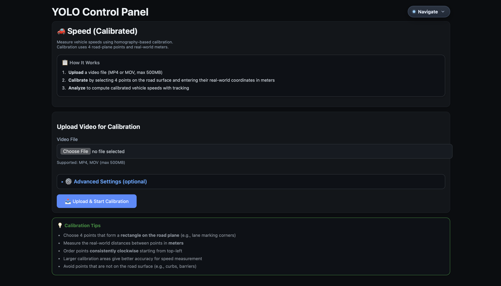

# 🚗 MoeWS - YOLO Object Detection & Speed Analysis Dashboard

A comprehensive web-based computer vision platform for **object detection**, **multi-object tracking**, and **calibrated speed measurement**. Supports offline video analysis, cloud-based inference via Roboflow, and real-time ROS 2 camera streams.



---

## 📋 Table of Contents

- [Features](#-features)
- [Tech Stack](#-tech-stack)
- [How Detection & Tracking Works](#-how-detection--tracking-works)
- [Quick Start](#-quick-start)
- [Usage Guide](#-usage-guide)
- [Project Structure](#-project-structure)
- [Configuration](#-configuration)
- [API Reference](#-api-reference)

---

## ✨ Features

### 🎬 Offline Video Analysis
- Upload video files (MP4, MOV) for batch processing
- YOLO v11 object detection with 80+ COCO classes
- Multi-object tracking with persistent IDs using ByteTrack
- Configurable meters-per-pixel speed estimation
- Export results as **CSV** and **JSON**
- Built-in analysis library with search, filtering, and playback

### 🚀 Calibrated Speed Measurement (NEW)
- **Homography-based calibration** using 4 ground-plane reference points
- Real-world speed in **km/h** with perspective correction
- **Speed violation detection** with automatic snapshots
- Configurable violation thresholds and capture modes
- Motion trail visualization for tracked objects
- Advanced filtering: outlier rejection, median smoothing, jump detection

### ☁️ Roboflow Cloud Inference
- Use Roboflow's hosted API - **no local GPU required**
- Frame-by-frame analysis with progress tracking
- Works with any Roboflow model (custom or pre-trained)
- Interactive detection viewer with bounding box overlays

### 📺 Live ROS 2 Streaming (Linux)
- Multi-camera support with auto-discovery
- Real-time YOLO inference overlay
- Browser-based visualization
- Launch manager for ROS 2 nodes

---

## 🛠 Tech Stack

### Core Framework
| Component | Technology | Purpose |
|-----------|------------|---------|
| **Web Server** | Flask 3.1 | REST API & HTML rendering |
| **Frontend** | Jinja2 + Vanilla JS | Dynamic templates, no heavy frameworks |
| **Database** | SQLite | Analysis library storage |

### Computer Vision & AI
| Component | Technology | Purpose |
|-----------|------------|---------|
| **Object Detection** | [Ultralytics YOLO v11](https://github.com/ultralytics/ultralytics) | State-of-the-art real-time detection |
| **Multi-Object Tracking** | [Supervision](https://github.com/roboflow/supervision) ByteTrack | Persistent ID tracking across frames |
| **Image Processing** | OpenCV 4.12 | Video I/O, frame manipulation, homography |
| **Tensor Operations** | PyTorch 2.8 | Neural network inference backend |
| **Cloud Inference** | Roboflow API | Optional GPU-free inference |

### Speed Measurement
| Component | Technology | Purpose |
|-----------|------------|---------|
| **Calibration** | Homography Matrix (3×3) | Pixel-to-world coordinate transform |
| **Smoothing** | Median + EMA filters | Noise reduction in speed estimates |
| **Outlier Rejection** | Acceleration-based | Remove tracking errors/ID switches |

### Optional Integrations
| Component | Technology | Purpose |
|-----------|------------|---------|
| **ROS 2** | Humble/Iron | Live camera integration |
| **rosbag2** | ROS 2 bags | Recorded sensor playback |

---

## 🔬 How Detection & Tracking Works

### 1. Object Detection (YOLO v11)

YOLO (You Only Look Once) is a single-shot object detector that processes the entire image in one forward pass:

```
Input Frame (1920×1080) 
    ↓
YOLO v11 Backbone (CSPDarknet) 
    ↓
Feature Pyramid Network (multi-scale features)
    ↓
Detection Head (class probabilities + bounding boxes)
    ↓
Non-Max Suppression (remove duplicates)
    ↓
Output: List of detections [(class, confidence, x1, y1, x2, y2), ...]
```

**Key Parameters:**
- `min_conf`: Minimum confidence threshold (default: 0.25)
- `max_det_per_frame`: Maximum detections per frame (default: 50)
- `class_filter`: Filter specific COCO classes (e.g., cars, trucks)

### 2. Multi-Object Tracking (ByteTrack)

ByteTrack assigns persistent IDs to detected objects across frames:

```
Frame N detections + Frame N-1 tracks
    ↓
High-confidence matching (IOU > 0.8)
    ↓
Low-confidence matching (recover occluded objects)
    ↓
Track creation (new objects) / Track deletion (lost objects)
    ↓
Output: Detections with track_id
```

**Key Parameters:**
- `track_thresh`: Minimum confidence to start new track (default: 0.25)
- `match_thresh`: IOU threshold for matching (default: 0.8)
- `track_buffer`: Frames to keep lost tracks (default: 30)

### 3. Speed Estimation

#### Basic Mode (Offline Analyzer)
Simple pixel-displacement speed using meters-per-pixel (MPP):

```
Speed = (pixel_distance × MPP × FPS) / time_window
```

#### Calibrated Mode (Speed Analyzer)
Uses homography for perspective-correct world coordinates:

```
1. User selects 4 ground-plane points in image
2. User enters real-world coordinates (meters)
3. System computes 3×3 homography matrix H

For each tracked object:
    pixel_coords (u, v) → world_coords (X, Y) via H
    speed = distance(world_coords) / time
```

**Smoothing Pipeline:**
```
Raw Speed → Outlier Rejection → Median Filter → EMA Smoothing → Final Speed
              (50 km/h/s max)    (5-sample)      (α=0.3)
```

### 4. Speed Violation Detection

Captures snapshots when vehicles exceed speed thresholds:

```
Track speed > threshold for > min_seconds?
    ↓
Capture Mode: "peak_speed" or "first_crossing"
    ↓
Save full frame + cropped vehicle image
    ↓
Log to violations.json with metadata
```

---

## 🚀 Quick Start

### Prerequisites

- **Python 3.10+** (tested on 3.10, 3.11, 3.12)
- **macOS** or **Linux** (Windows via WSL2)
- ~2GB disk space for dependencies

### 1. Clone & Setup

```bash
# Clone the repository
git clone https://github.com/mowda2/MoeWS.git
cd MoeWS

# Run automated setup (creates venv, installs deps)
./scripts/setup.sh
```

Or manually:

```bash
# Create virtual environment
python3 -m venv venv
source venv/bin/activate

# Install dependencies
pip install -r requirements.txt
```

### 2. Download YOLO Model

The YOLO model file is required for local inference:

```bash
# Download YOLO v11 nano model (~6MB)
wget https://github.com/ultralytics/assets/releases/download/v8.3.0/yolo11n.pt
```

### 3. Start the Dashboard

```bash
# Recommended: Use the run script
./scripts/run_dashboard.sh

# Or manually:
source venv/bin/activate
export PYTHONPATH="$PWD/src"
python -m moe_yolo_pipeline.moe_yolo_pipeline.web_video_bridge
```

### 4. Open in Browser

| Page | URL | Description |
|------|-----|-------------|
| **Dashboard** | http://localhost:5000 | Main landing page |
| **Offline Analysis** | http://localhost:5000/offline | Upload & analyze videos |
| **Speed (Calibrated)** | http://localhost:5000/speed | Homography-based speed |
| **Roboflow** | http://localhost:5000/roboflow | Cloud inference |
| **Library** | http://localhost:5000/library | Past analyses |

---

## 📖 Usage Guide

### Offline Video Analysis

1. Navigate to **http://localhost:5000/offline**
2. Click "Upload Video" and select MP4/MOV file
3. Configure analysis settings:
   - **Confidence Threshold**: 0.25 (lower = more detections)
   - **Device**: `cpu` or `cuda:0` for GPU
   - **MPP**: Meters per pixel for speed estimation
4. Click "Run Analysis"
5. View results: annotated video, CSV export, JSON summary

### Calibrated Speed Measurement

1. Navigate to **http://localhost:5000/speed**
2. Upload a traffic video
3. **Calibration Step:**
   - Identify 4 points on the road (e.g., lane marking corners)
   - Note their pixel coordinates (hover over image)
   - Enter real-world coordinates in meters
   - Click "Save Calibration"
4. Configure detection settings (optional):
   - Enable violation detection
   - Set speed threshold (e.g., 110 km/h)
   - Enable motion trails
5. Click "Run Analysis"
6. View results: speeds in km/h, violation gallery, per-track stats

### Roboflow Cloud Inference

1. Set environment variables:
   ```bash
   export ROBOFLOW_API_KEY="your_api_key"
   export ROBOFLOW_MODEL="coco/1"  # or your model
   ```
2. Navigate to **http://localhost:5000/roboflow**
3. Upload video and configure frame skip
4. View detections in interactive viewer

---

## 📁 Project Structure

```
MoeWS/
├── src/
│   └── moe_yolo_pipeline/
│       ├── moe_yolo_pipeline/           # Main Python package
│       │   ├── web_video_bridge.py      # Flask app entry point
│       │   ├── offline_routes.py        # /offline endpoints
│       │   ├── offline_analyzer.py      # YOLO + ByteTrack logic
│       │   ├── speed_routes.py          # /speed endpoints
│       │   ├── speed_analyzer.py        # Homography speed measurement
│       │   ├── roboflow_routes.py       # /roboflow endpoints
│       │   ├── roboflow_client.py       # Roboflow API wrapper
│       │   ├── library_db.py            # SQLite database layer
│       │   ├── yolo_inference_node.py   # ROS 2 node (optional)
│       │   ├── templates/               # Jinja2 HTML templates
│       │   │   ├── index.html           # Main dashboard
│       │   │   ├── offline.html         # Offline analysis page
│       │   │   ├── library.html         # Analysis library
│       │   │   ├── speed/               # Speed module templates
│       │   │   └── roboflow/            # Roboflow templates
│       │   ├── static/                  # CSS, JS assets
│       │   └── jobs/                    # Analysis job outputs
│       ├── launch/                      # ROS 2 launch files
│       └── setup.py                     # ROS 2 package setup
├── runs/
│   └── speed/                           # Speed analysis outputs
├── scripts/
│   ├── setup.sh                         # Environment setup
│   └── run_dashboard.sh                 # Start script
├── tests/
│   └── test_smoke.py                    # Basic import tests
├── requirements.txt                     # Python dependencies
├── yolo11n.pt                          # YOLO model weights
└── README.md
```

---

## ⚙️ Configuration

### Environment Variables

#### Detection & Tracking
| Variable | Default | Description |
|----------|---------|-------------|
| `MOE_TRACK_MIN_CONF` | 0.0 | Extra confidence filter |
| `MOE_TRACK_MIN_BOX_AREA` | 0 | Minimum bbox area (px²) |
| `MOE_TRACK_CLASSES` | "" | Class filter (comma-separated IDs) |
| `MOE_TRACK_BUFFER` | 30 | ByteTrack lost track buffer |
| `MOE_TRACK_THRESH` | 0.25 | Track activation threshold |
| `MOE_SHOW_TRAILS` | false | Enable motion trails |

#### Speed Analysis
| Variable | Default | Description |
|----------|---------|-------------|
| `MOE_SPEED_MAX_KPH` | 160.0 | Maximum plausible speed |
| `MOE_SPEED_WINDOW_S` | 0.7 | Smoothing window (seconds) |
| `MOE_SPEED_MIN_DT_S` | 0.1 | Minimum time delta |
| `MOE_SPEED_CONF` | 0.25 | Detection confidence |

#### Roboflow
| Variable | Required | Description |
|----------|----------|-------------|
| `ROBOFLOW_API_KEY` | Yes | Your Roboflow API key |
| `ROBOFLOW_MODEL` | Yes | Model ID (e.g., "coco/1") |
| `ROBOFLOW_CONFIDENCE` | No | Confidence threshold (0.4) |

### Speed Analysis Settings (UI)

All configurable via the web interface:

- **Detection**: confidence, max detections, class filter, min box area
- **Tracking**: thresholds, buffer size
- **Speed**: max speed, smoothing window, outlier rejection
- **Performance**: frame skip, resize width
- **Trails**: enable, duration, thickness, fade effect
- **Violations**: enable, threshold, capture mode, cooldown

---

## 📡 API Reference

### Offline Analysis Endpoints

| Method | Endpoint | Description |
|--------|----------|-------------|
| GET | `/offline` | Analysis upload page |
| POST | `/offline/upload` | Upload video for analysis |
| GET | `/offline/status/<job_id>` | Job status & progress |
| GET | `/offline/results/<job_id>` | Analysis results page |
| GET | `/offline/artifact/<job_id>/<file>` | Download artifacts |

### Speed Analysis Endpoints

| Method | Endpoint | Description |
|--------|----------|-------------|
| GET | `/speed` | Upload & settings page |
| POST | `/speed/upload` | Upload video |
| GET | `/speed/calibrate/<job_id>` | Calibration page |
| POST | `/speed/calibrate/<job_id>` | Save calibration |
| GET | `/speed/run/<job_id>` | Run analysis |
| GET | `/speed/results/<job_id>` | Results page |
| GET | `/speed/artifact/<job_id>/<file>` | Download artifacts |

### Library Endpoints

| Method | Endpoint | Description |
|--------|----------|-------------|
| GET | `/library` | Analysis library page |
| GET | `/library/search` | Search analyses |
| DELETE | `/library/<job_id>` | Delete analysis |

---

## 🧪 Testing

Run the smoke tests to verify installation:

```bash
source venv/bin/activate
pytest tests/ -v
```

---

## 📄 License

MIT License - See [LICENSE](LICENSE) for details.

---

## 🤝 Contributing

1. Fork the repository
2. Create a feature branch (`git checkout -b feature/amazing`)
3. Commit changes (`git commit -m 'Add amazing feature'`)
4. Push to branch (`git push origin feature/amazing`)
5. Open a Pull Request

---

**Built with ❤️ for computer vision research and traffic analysis.**
